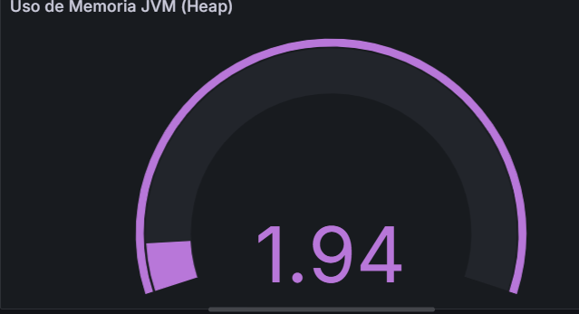
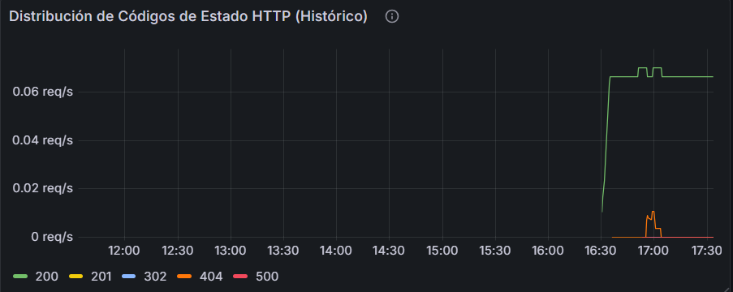

# Bitácora Experimento - Observabilidad y Monitoreo

**Nombre del estudiante:** _____________________________  
---
Cuando acabes no olvides ayudarnos evaluando tu ⭐[experiencia](https://forms.office.com/r/JCyhCpujrt)⭐
---

## Tabla de Contenidos
- [Etapa 1: Preparación del Ambiente](#etapa-1-preparación-del-ambiente)
- [Etapa 2: Métricas Iniciales](#etapa-2-métricas-iniciales)
- [Etapa 2.1: Dashboard Base en Grafana](#etapa-21-dashboard-base-en-grafana)
- [Etapa 2.2: Propuesta de Métrica Personalizada](#etapa-22-propuesta-de-métrica-personalizada)
- [Etapa 3: Experimentación y Análisis del Sistema](#etapa-3-experimentación-y-análisis-del-sistema)

---

## Etapa 1: Preparación del Ambiente

### 1.1. Información de la aplicación
dns juana-lozano-c-app.obs-stack.eci-idp.click
{
  "version": "1.0.0",
  "message": "URL Shortener Service",
  "status": "running"
}
### 1.2. Verificación del despliegue

**¿La aplicación se desplegó correctamente?** 

- [x] Sí
- [ ] No

**Captura de pantalla de la aplicación funcionando:**


### 1.3. Observaciones y problemas encontrados (opcional)
NA
```


```

---

## Etapa 2: Métricas Iniciales

### 2.0.1. Generación de tráfico

**Endpoints probados:**

- [x] `GET /api/`
- [x] `POST /api/shorten`
- [x] `GET /api/{shortCode}`
- [x] `GET /api/urls`


### 2.0.2. Análisis de dos métricas relevantes

#### Métrica 1

**Nombre de la métrica:**  
```
http_server_requests_seconds_count

```

**Tipo de métrica:** 
- [x] Counter
- [ ] Gauge 
- [ ] Histogram 
- [ ] Summary

**Descripción de qué información aporta:**
```
Esta métrica cuenta el número de segundos que se demora en responder una solicitud. Al ser un counter, su valor siempre aumenta. Es la medida fundamental de la carga de trabajo que el sistema está manejando.

```

**Relación con otras métricas (si aplica):**
```
Directa: está intrínsecamente ligada a http_server_requests_seconds_sum. Con ambas se puede calcular la latencia promedio de las solicitudes.

Indirecta: un aumento en esta métrica generalmente se correlaciona con un aumento en el uso de CPU (process_cpu_usage), el uso de memoria (jvm_memory_used_bytes) y, potencialmente, en la actividad de Garbage Collection (jvm_gc_pause_seconds), ya que el sistema necesita más recursos para manejar más peticiones.

```

**¿En que escenarios puede ayudar esta métrica?**
```
Permite crear dashboards para ver el tráfico en tiempo real, identificar horas pico o detectar caídas repentinas de tráfico que podrían indicar un problema.
De igual manera se pueden configurar alertas si el número de errores (ej. códigos de estado 5xx) crece demasiado rápido en relación con el total de solicitudes, lo que indicaría una posible falla en la aplicación.


```

**¿Qué etiquetas (labels) se utilizan para agrupar los datos?**
```
method: GET, POST (Indica el verbo HTTP).
status: 200, 201, 302, 404, 500 (Código de respuesta HTTP).
outcome: SUCCESS, CLIENT_ERROR, SERVER_ERROR, REDIRECTION (Clasificación del código de estado).
uri: /api/shorten, /actuator/prometheus, /api/{shortCode}, /** (El endpoint al que se accede).
exception: none, RuntimeException (Si se lanzó una excepción).

```

---

#### Métrica 2

**Nombre de la métrica:**  
```
process_cpu_usage
```

**Tipo de métrica:** 
- [ ] Counter
- [x] Gauge 
- [ ] Histogram 
- [ ] Summary

**Descripción de qué información aporta:**
```
Esta métrica muestra el uso reciente de CPU por parte del proceso de la JVM. Es un valor que fluctúa constantemente entre 0 y 1 (o 0% y 100% en una representación porcentual), indicando la proporción de tiempo de CPU que el proceso está utilizando.
Tipo de Métrica: Gauge (su valor puede subir y bajar).


```

**Relación con otras métricas (si aplica):**
```
Directa: Un aumento en http_server_requests_seconds_count suele provocar un aumento en process_cpu_usage, ya que se requiere más procesamiento.
Indirecta: Picos prolongados de CPU pueden llevar a un aumento en la latencia de las solicitudes (http_server_requests_seconds_max). También puede relacionarse con la actividad de GC (jvm_gc_pause_seconds), ya que la recolección de basura consume CPU.


```

**¿En que escenarios puede ayudar esta métrica?**
```
Ayuda a identificar si la aplicación está alcanzando sus límites de procesamiento. Un uso de CPU constantemente alto por ejemplo si llega a 80 o 90%, puede indicar la necesidad de escalar la aplicación horizontalmente (más instancias) o verticalmente (más CPU). Sirve para correlacionar el lanzamiento de nuevas funcionalidades o cambios en el código con un aumento inesperado en el consumo de CPU.


```

**¿Qué etiquetas (labels) se utilizan para agrupar los datos?**
```
no tiene labels 


```

---

## Etapa 2.1: Dashboard Base en Grafana


### 2.1.1. Evidencia: Dashboard Base en Grafana con los 4 paneles iniciales

**Captura de pantalla del dashboard:**


### 2.1.2. Visualizaciónes Adicionales (Con las metricas actuales)

#### Visualización Adicional 1

**Propósito:**
```
¿Qué quieres analizar o mostrar? Menciona qué métrica(s) vas a usar
voy a medir que cantidad de memoria se usa 

```

**Título del panel:**
```
uso de memoria JVM Heap
```

**Consulta (PromQL o LogQL):**
```
sum(jvm_memory_used_bytes{applicationName="juana-lozano-c-app-monitoring", area="heap"}) / sum(jvm_memory_max_bytes{applicationName="juana-lozano-c-app-monitoring", area="heap"}) * 100

```

**Tipo de visualización:** 
- [ ] Time series
- [x] Gauge
- [ ] Bar chart
- [ ] Stat
- [ ] Logs
- [ ] Otro: _____

**Otros ajustes aplicados (colores, unidades, etc.) (opcional):**
```
Unidades: Percent (0.0-1.0) o Percent (0-100).

Thresholds: Verde (0-70%), Amarillo (70-85%), Rojo (>85%).

```

**Captura de pantalla:**


**Análisis (2-3 frases):**
```
¿Qué conclusiones o patrones observas?

Puedo notar que no s ehace tanto uso de la JVM

```

---

#### Visualización Adicional 2

**Propósito:**
```
¿Qué quieres analizar o mostrar? Menciona qué métrica(s) vas a mostrar
Analizar la proporción de respuestas exitosas (2xx) frente a errores o redirecciones. Mientras que tu panel actual de "Tasa de errores" solo mira el fallo, este te permite ver el "todo" y entender si un pico de tráfico es saludable o una anomalía de red.


```

**Título del panel:**
```
Distribución de Respuestas HTTP (Stack)
```

**Consulta (PromQL o LogQL):**
```
Consejo: Si usaste la interfaz de Grafana para crear el panel, puedes copiar la consulta que se muestra en la caja de texto de la seccion Code.

```

**Tipo de visualización:** 
- [x] Time series
- [ ] Gauge
- [ ] Bar chart
- [ ] Stat
- [ ] Logs
- [ ] Otro: _____

**Otros ajustes aplicados (colores, unidades, etc.) (opcional):**
```
sum by (status) (rate(http_server_requests_seconds_count{app="juana-lozano-c-app-monitoring"}[5m]))

```

**Captura de pantalla:**



**Análisis (2-3 frases):**
```
¿Qué conclusiones o patrones observas?

Solo se han recibido respuestas 200 y 404

```

---

### 2.1.3. Análisis final del dashboard

**¿Qué otros datos te gustaría visualizar si tuvieras más información disponible?**
```
Me gustaría visualizar analíticas de usuario más profundas, como la ubicación geográfica de los clics y el tipo de dispositivo (móvil vs. escritorio) para entender el alcance real de los enlaces. También integraría métricas de rendimiento de base de datos para detectar cuellos de botella en las consultas y un Top 10 de URLs más visitadas, transformando datos técnicos en información estratégica de negocio


```

---

## Etapa 2.2: Propuesta de Métrica Personalizada


### Análisis y propuesta de la métrica propia (en Java)

**1. Nombre de la métrica:**
```
url_shortener_shortcode_not_found_total
```

**2. Tipo de métrica:**
- [x] Counter
- [ ] Gauge

**3. ¿Qué comportamiento mide?**
```
Cuenta el número de intentos de acceso a códigos cortos que no existen en el sistema.
Cada vez que un usuario intenta redirigirse usando un código que no está registrado,
la métrica incrementa en 1. Esto se detecta en el método getOriginalUrl() del servicio
cuando la búsqueda retorna null.
```

**4. ¿Por qué es relevante para el sistema?**
```
• DETECCIÓN DE ANOMALÍAS: Un aumento inesperado de accesos fallidos puede indicar
  intentos de ataque o bots probando códigos aleatorios.

• EXPERIENCIA DEL USUARIO: Alerta sobre URLs que pueden haber sido eliminadas o 
  compartidas incorrectamente, permitiendo mejorar la comunicación del servicio.

• CALIDAD DE SERVICIO: Comparar la proporción de accesos exitosos vs fallidos es
  un indicador clave de cuán efectivo es el servicio (tasa de error lógico).

• PATRONES DE USO: Identifica qué códigos son más populares (menos fallidos) vs
  cuáles generan más intentos de acceso inválido.

• SEGURIDAD: Monitorear picos de 404s ayuda a detectar intentos de enumeración
  o fuerza bruta sobre los códigos cortos.
```


---

### 2.2.3 Implementación de la Métrica en el Código

**Ubicación del cambio:**
`telemetry-lab/src/main/java/com/telemetry/urlshortener/service/UrlShortenerService.java`

**Cambios realizados:**

1. **Declaración del Counter** (Línea 26):
```java
private final Counter shortcodeNotFoundCounter;
```

2. **Registro en el constructor** (Líneas 33-35):
```java
this.shortcodeNotFoundCounter = Counter.builder("url_shortener_shortcode_not_found_total")
        .description("Total number of attempts to access non-existent short codes")
        .register(meterRegistry);
```

3. **Incremento en el método getOriginalUrl()** (Línea 80):
```java
if (mapping != null) {
    logger.info("URL accessed - Code: {}", shortCode);
} else {
    logger.warn("Short code not found: {}", shortCode);
    shortcodeNotFoundCounter.increment();  // ← AQUÍ se incrementa
}
```

**Descripción:**
El Counter se incrementa exactamente cuando un usuario intenta acceder a un código corto que no existe. Esto captura todos los intentos de redirección fallidos por código no encontrado.

---

### Visualización en Grafana

**1. ¿Qué tipo de panel usaste en Grafana?**

- [ ] Time series  
- [ ] Gauge  
- [ ] Stat  
- [ ] Bar chart  
- [ ] Otro: _____

**2. ¿Qué consulta PromQL vas a utilizar?**
```promql


```

**3. ¿Cuál es el propósito de la visualización?**
```
Provee una interpretación en palabras con el propósito de la visualización. Que te interesa ver en el panel?


```

---

### Panel creado en Grafana

**Captura de pantalla del panel en Grafana:**

> _[Inserta aquí la imagen del panel mostrando la métrica visualizada]_

---

## Etapa 3: Experimentación y Análisis del Sistema

### 3.1. Detección de anomalías y puntos de interés

**1. Como describirias la anomalía?**

```


```

**2. Que paneles te ayudaron a identificarlo?**

``` 


```

**3. Cual podria ser la causa de la anomalía?**

``` 


```

**Captura de pantalla del dashboard mostrando la anomalía:**

> _[Inserta aquí la imagen]_

---

### 3.2. Intento de corrección de anomalías


#### 3.2.1. Modificación del código

**Descripción del ajuste realizado:**
```
Describe en pocas palabras el ajuste realizado.


```

#### 3.2.2. Resultados después del despliegue

**¿El ajuste surtió efecto?**
- [ ] Sí 
- [ ] No 
- [ ] Parcialmente


**Captura de pantalla del dashboard después del ajuste:**

> _[Inserta aquí la imagen del estado del dashboard posterior al ajuste]_

---

### 5.7. Reflexión final

**¿Qué panel te resultó más útil para detectar problemas?**
```


```

**¿Qué métrica aporta mayor valor para monitorear un sistema real?**
```


```

**¿Qué agregarías o mejorarías en tu dashboard?**
```


```

**Fin de la bitácora**
